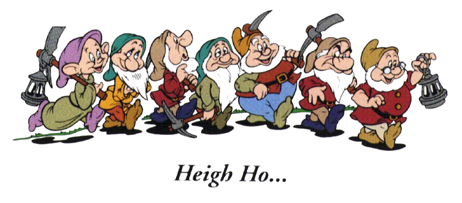

# Heigh Ho

> We do be making money

The repository name is inspired on the seven dwarfs of Snow White, more specifically about their [mining song](https://www.youtube.com/watch?v=HI0x0KYChq4), making reference to the process of mining block on the Bitcoin Blockchain. This is an implementation for the CPU and GPU with C++ and C CUDA, in order to compare results and check the benefits of a parallel solution
